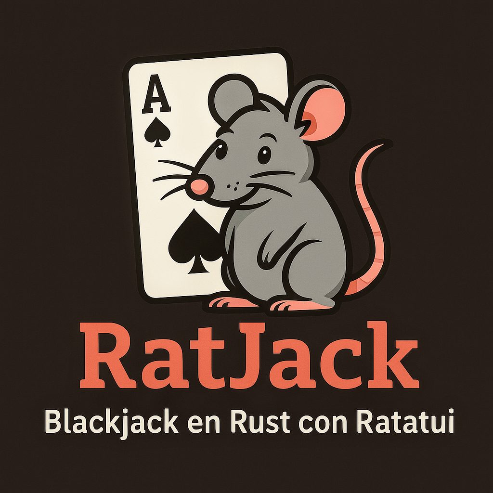

# 🃏 RatJack - Blackjack en Rust con Ratatui

**RatJack** es un juego de **Blackjack** interactivo y simulador escrito en **Rust**, con una interfaz de usuario basada en **Ratatui** para la terminal.

## 🎲 Características y Mejoras Recientes

✅ **Interfaz Visual de Cartas Mejorada:** Las cartas se renderizan lado a lado en filas ordenadas con colores según su palo (rojo para corazones y diamantes, cyan/blanco para picas y tréboles), evitando recortes verticales sin importar cuántas cartas se acumulen en la mano.  
✅ **Conteo de Cartas de la Banca:** Durante tu turno, se muestra cuántas cartas tiene la banca en total (ej. `? (2 cartas)`) junto con marcadores visuales para las cartas ocultas, respetando las reglas del Blackjack.  
✅ **Victoria Automática al 21:** Al alcanzar 21 puntos (al repartir o pedir), el turno de la banca se resuelve automáticamente sin requerir pulsar ninguna tecla.  
✅ **Continuación Inmediata al Plantarse:** Al elegir plantarse (`s` o `2`), la partida continúa y se resuelve de forma instantánea.  
✅ **Estrategias Personalizables:** Configura algoritmos separados para la banca y el jugador en la UI.

## 🚀 Instalación y Ejecución

Asegúrate de tener **Rust** y **Cargo** instalados. Clona el repositorio y ejecútalo con:

```bash
git clone https://github.com/tomas2p/ratjack.git
cd ratjack
cargo run -- --ui --ui-strategies "threshold:17,threshold:16"
```

## 🎮 Cómo jugar

Usa las teclas en el modo interactivo:

- <kbd>↵ (Enter)</kbd> / <kbd>1</kbd> / <kbd>p</kbd> → Pedir carta (Hit)
- <kbd>2</kbd> / <kbd>s</kbd> → Plantarse (Stand)
- <kbd>n</kbd> → Nueva partida
- <kbd>q</kbd> → Salir

## 📜 Licencia

Este proyecto está bajo la licencia [MIT](LICENSE). ¡Siéntete libre de contribuir!
